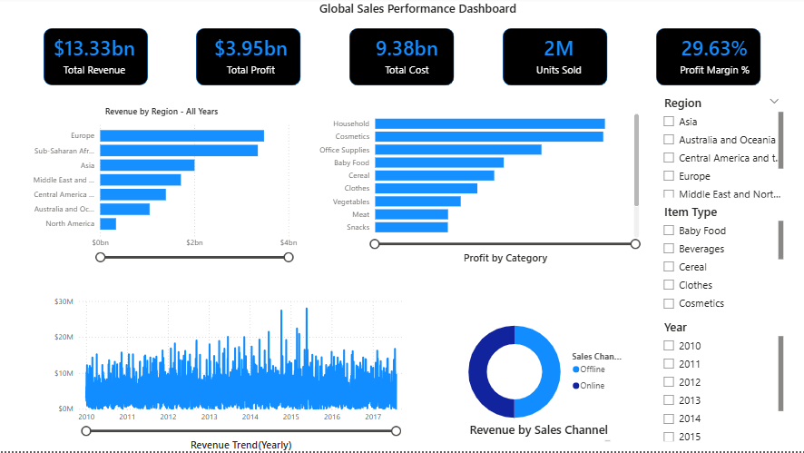

# Global Sales SQL Analysis
📌 Project Overview
This project analyzes global sales data using PostgreSQL to uncover profitability trends across product categories, sales channels, and order priorities.
The goal was to answer key business questions using SQL aggregation, grouping, and date functions.

🛠 Tools Used
- PostgreSQL
- SQL
- Microsoft Excel (Data Source)

📊 Business Questions Answered
1. Which product type is most profitable?
2. Does Online or Offline sales generate more profit?
3. Which order priority generates the highest profit?
4. How does profit trend monthly over time?

   📈 Key Insights
- Household products generated the highest profit.
- Offline sales produced more total profit than online sales.
- Order priority C generated the highest profit.
- Monthly profit shows fluctuations across multiple years.

🧠 SQL Skills Demonstrated
- SUM() Aggregation
- GROUP BY
- ORDER BY
- Date Functions (DATE_TRUNC, TO_CHAR)
- Business Insight Interpretation

  📷 Query Results

🏅 Overall Revenue & Profit

📦 Profit by Product Type

🛒 Profit by Sales Channel

⚡ Profit by Order Priority

📈 Monthly Profit Trend

📊 Power BI Dashboard

  👤 Author
Dr. Oyemade  
SQL Data Analysis Project
---

## 📂 Project Structure
